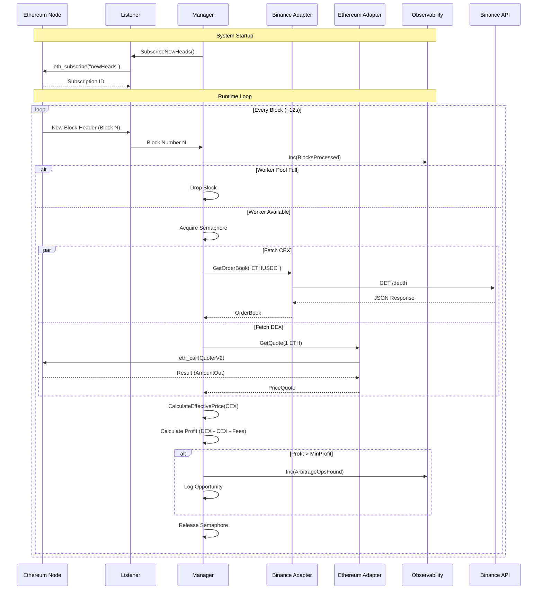

# System Architecture

## Overview

The CEX-DEX Arbitrage Bot is designed as a high-performance, concurrent system that monitors price discrepancies between Binance (Centralized Exchange) and Uniswap V3 (Decentralized Exchange). It follows the **Hexagonal Architecture** (Ports & Adapters) pattern to decouple core business logic from external infrastructure.

## 1. Component Diagram (Hexagonal Architecture)

This diagram illustrates how the core logic is isolated from the outside world via Ports (Interfaces) and Adapters (Implementations).

```mermaid
graph TD
    subgraph "External World"
        Binance[Binance API]
        Ethereum[Ethereum Node (RPC/WS)]
        Prometheus[Prometheus]
    end

    subgraph "Application"
        subgraph "Adapters (Infrastructure)"
            BinanceAdapter[Binance Adapter]
            EthAdapter[Ethereum Adapter]
            Listener[Blockchain Listener]
            Metrics[Metrics Handler]
        end

        subgraph "Core (Business Logic)"
            Ports{Ports / Interfaces}
            Manager[Manager Service]
            Domain[Domain Models]
        end
    end

    %% Relationships
    Manager --> Ports
    BinanceAdapter ..|> Ports : Implements
    EthAdapter ..|> Ports : Implements
    Listener ..|> Ports : Implements

    BinanceAdapter <--> Binance
    EthAdapter <--> Ethereum
    Listener <--> Ethereum
    Metrics <--> Prometheus

    Manager --> Domain
    Ports --> Domain
```

## 2. Class Diagram

This diagram details the internal structure of the Go codebase, showing the relationships between the Manager, Interfaces, and Domain entities.

```mermaid
classDiagram
    %% Domain
    class OrderBook {
        +Asks []PriceLevel
        +Bids []PriceLevel
        +Timestamp Time
        +CalculateEffectivePrice(side, amount) (Decimal, bool)
    }
    class PriceQuote {
        +Price Decimal
        +GasEstimate BigInt
        +Timestamp Time
    }
    class ArbitrageOpportunity {
        +BuyOn String
        +SellOn String
        +Profit Decimal
    }

    %% Ports
    class ExchangeAdapter {
        <<interface>>
        +GetOrderBook(symbol) (*OrderBook, error)
    }
    class PriceProvider {
        <<interface>>
        +GetQuote(tokenIn, tokenOut, amount, fee) (*PriceQuote, error)
    }
    class BlockchainListener {
        <<interface>>
        +SubscribeNewHeads() (<-chan BigInt, <-chan error, error)
    }

    %% Core
    class Manager {
        -cfg Config
        -cex ExchangeAdapter
        -dex PriceProvider
        -listener BlockchainListener
        -sem chan struct{}
        +Start(ctx) error
        -processBlock(ctx, blockNum)
        -checkArbitrageForSize(ctx, ob, amount)
    }

    %% Adapters
    class BinanceAdapter {
        -client HTTPClient
        +GetOrderBook(symbol) (*OrderBook, error)
    }
    class EthereumAdapter {
        -client EthClient
        +GetQuote(...) (*PriceQuote, error)
    }
    class ListenerImpl {
        -clientURL String
        +SubscribeNewHeads()
    }

    %% Relationships
    Manager --> ExchangeAdapter
    Manager --> PriceProvider
    Manager --> BlockchainListener
    Manager ..> OrderBook : Uses
    Manager ..> PriceQuote : Uses
    Manager ..> ArbitrageOpportunity : Creates

    BinanceAdapter ..|> ExchangeAdapter
    EthereumAdapter ..|> PriceProvider
    ListenerImpl ..|> BlockchainListener
```

## 3. Sequence Diagram (Block Processing Flow)

This diagram shows the runtime flow of the system when a new block is received from the Ethereum network.



## 4. Directory Structure

- **`cmd/bot`**: The entry point. Initializes adapters, loads config, and starts the Manager.
- **`internal/core/domain`**: Pure business entities. No external dependencies.
- **`internal/core/ports`**: Interfaces defining the contract between Core and Adapters.
- **`internal/core/services`**: The `Manager` contains the orchestration logic.
- **`internal/adapters`**: Implementations of the ports (Binance, Ethereum, Blockchain).
- **`internal/observability`**: Prometheus metrics definitions.
- **`docs`**: This documentation.
